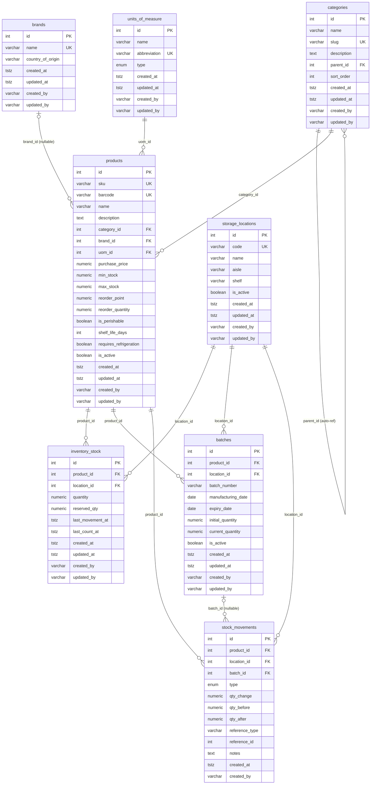
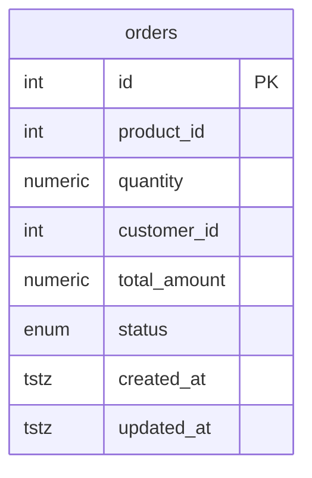

# Diagrama Entidad-Relación — technical-interview-kibernum

Dos bases de datos independientes. Las relaciones entre `orders_db` e `inventory_db` son **lógicas** (sin FK física): la consistencia se garantiza mediante la saga Kafka `order.created → inventory.validated → order.confirmed`.

---

## inventory_db



---

## orders_db



> **`orders.product_id`** referencia lógica a `inventory_db.products.id` — sin FK física por tratarse de bases de datos independientes.

---

## Flujo saga (cross-DB)

```
orders-ms          inventory-ms          payments-ms
────────────────────────────────────────────────────
POST /orders
  → INSERT orders (pending)
  → KAFKA: order.created
                           ← KAFKA: order.created
                           validate stock
                           UPDATE inventory_stock
                           INSERT stock_movements
                           → KAFKA: inventory.validated
                                        ó
                           → KAFKA: inventory.insufficient
← KAFKA: inventory.validated
  UPDATE orders (confirmed)
  → KAFKA: order.confirmed
                                        ← KAFKA: order.confirmed
                                        process payment
                                        → KAFKA: payment.processed
← KAFKA: payment.processed
  UPDATE orders (paid)
```

---

## Validación de entidades TypeORM vs DDL

### inventory_db

| Tabla DDL          | Entidad TypeORM               | Estado  |
|--------------------|-------------------------------|---------|
| `categories`       | `CategoryOrmEntity`           | ✅ OK   |
| `brands`           | `BrandOrmEntity`              | ✅ OK   |
| `units_of_measure` | `UnitOfMeasureOrmEntity`      | ✅ OK   |
| `products`         | `ProductOrmEntity`            | ✅ OK   |
| `storage_locations`| `StorageLocationOrmEntity`    | ✅ OK   |
| `inventory_stock`  | `InventoryStockOrmEntity`     | ✅ OK   |
| `batches`          | `BatchOrmEntity`              | ✅ OK   |
| `stock_movements`  | `StockMovementOrmEntity`      | ✅ OK   |

**Notas inventory-ms:**
- Columnas `| null` en TypeScript usan `type:` explícito en `@Column` para evitar `DataTypeNotSupportedError` con `emitDecoratorMetadata`.
- `stock_movements` extiende `ImmutableAuditEntity` (solo `created_at` / `created_by`), coherente con la tabla append-only del DDL.
- El enum `movement_type` del DDL coincide con `MovementType` TypeScript (mismo conjunto de valores).

### orders_db

| Tabla DDL | Entidad TypeORM    | Estado  |
|-----------|--------------------|---------|
| `orders`  | `OrderOrmEntity`   | ✅ OK   |

**Detalle columna a columna — `orders`:**

| Columna DDL   | TypeORM `@Column`                                         | Match |
|---------------|-----------------------------------------------------------|-------|
| `id`          | `@PrimaryGeneratedColumn()`                               | ✅    |
| `product_id`  | `@Column({ name: 'product_id' })`                        | ✅    |
| `quantity`    | `@Column({ type: 'numeric', precision: 10, scale: 3 })`  | ✅    |
| `customer_id` | `@Column({ name: 'customer_id' })`                       | ✅    |
| `total_amount`| `@Column({ name: 'total_amount', type: 'numeric', precision: 10, scale: 2 })` | ✅ |
| `status`      | `@Column({ type: 'enum', enum: OrderStatus, enumName: 'order_status', default: OrderStatus.PENDING })` | ✅ |
| `created_at`  | `@CreateDateColumn({ name: 'created_at' })` (AuditableEntity) | ✅ |
| `updated_at`  | `@UpdateDateColumn({ name: 'updated_at' })` (AuditableEntity) | ✅ |

**Valores del enum `order_status`:**

| DDL value    | TypeScript `OrderStatus` | Match |
|--------------|--------------------------|-------|
| `'pending'`  | `PENDING = 'pending'`    | ✅    |
| `'confirmed'`| `CONFIRMED = 'confirmed'`| ✅    |
| `'paid'`     | `PAID = 'paid'`          | ✅    |
| `'cancelled'`| `CANCELLED = 'cancelled'`| ✅    |
