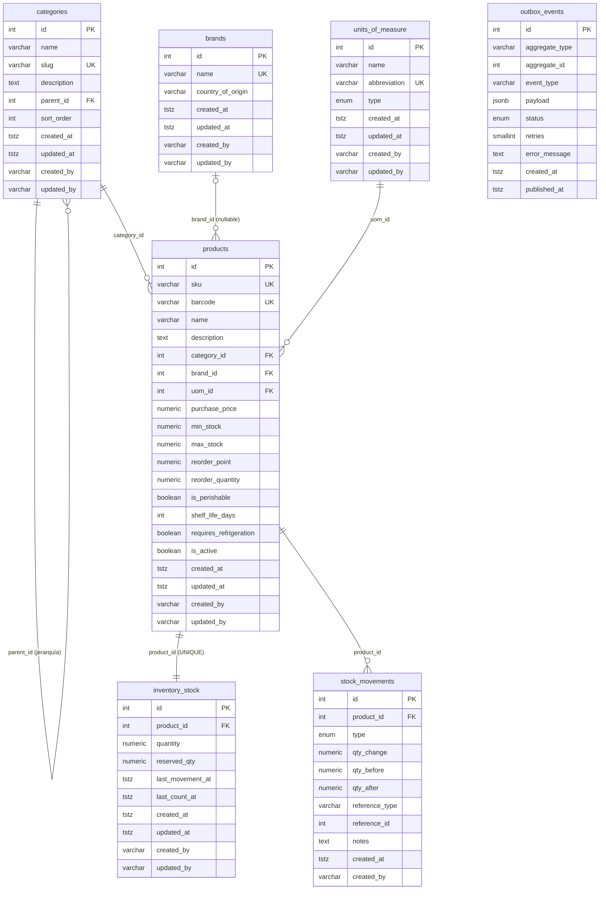
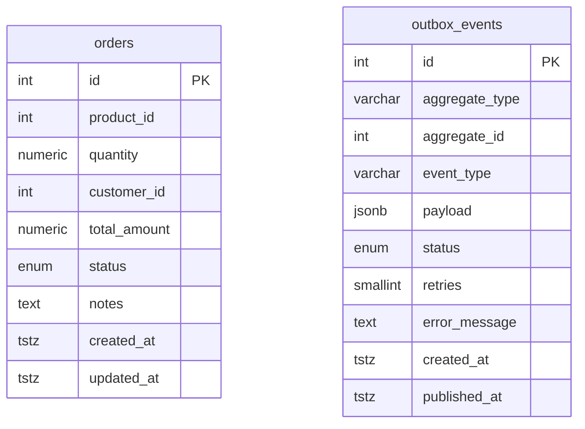
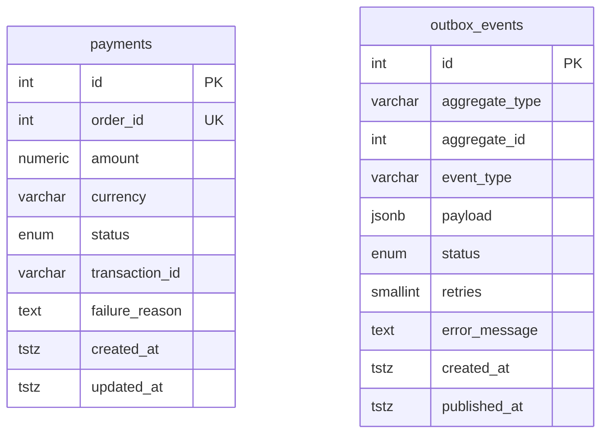

# Diagrama Entidad-Relación — technical-interview-kibernum

---

## Vista de plataforma — 3 bases de datos

> Líneas **sólidas** = FK física (misma base de datos).  
> Líneas **punteadas** = referencia lógica cross-DB (sin FK, garantizada por saga Kafka).

---

## inventory\_db — Detalle completo

**Enums:**
| Enum | Valores |
|---|---|
| `uom_type` | `MASS` · `VOLUME` · `UNIT` · `PACK` |
| `movement_type` | `RESERVATION` · `RESERVATION_CONFIRMED` · `RESERVATION_RELEASED` |
| `outbox_event_status` | `pending` · `published` · `failed` |

---

## orders\_db — Detalle completo

**Enums:**
| Enum | Valores |
|---|---|
| `order_status` | `pending` · `confirmed` · `paid` · `cancelled` |
| `outbox_event_status` | `pending` · `published` · `failed` |

---

## payments\_db — Detalle completo

**Enums:**
| Enum | Valores |
|---|---|
| `payment_status` | `pending` · `approved` · `rejected` |
| `outbox_event_status` | `pending` · `published` · `failed` |

---
