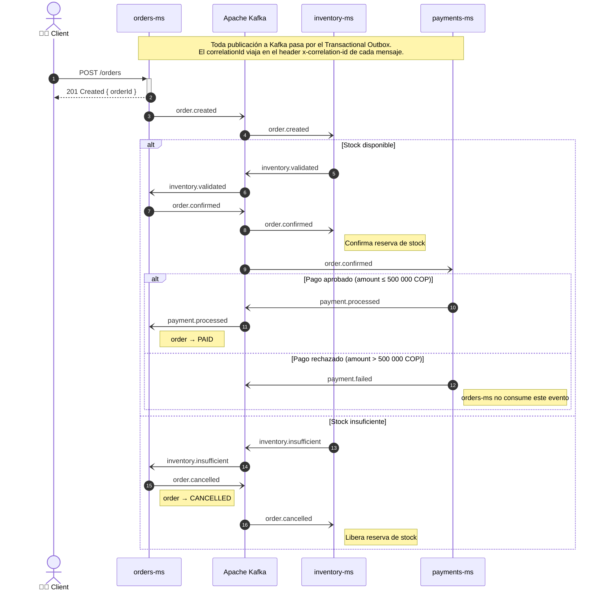

# Event-Driven Sequence Diagram

Comunicación entre microservicios mediante Apache Kafka.

---

## Flujo de eventos

---

## Tópicos Kafka

| Tópico                   | Publicado por | Consumido por             |
|--------------------------|---------------|---------------------------|
| `order.created`          | orders-ms     | inventory-ms              |
| `order.confirmed`        | orders-ms     | inventory-ms, payments-ms |
| `order.cancelled`        | orders-ms     | inventory-ms              |
| `inventory.validated`    | inventory-ms  | orders-ms                 |
| `inventory.insufficient` | inventory-ms  | orders-ms                 |
| `payment.processed`      | payments-ms   | inventory-ms, orders-ms   |
| `payment.failed`         | payments-ms   | inventory-ms, orders-ms   |       
