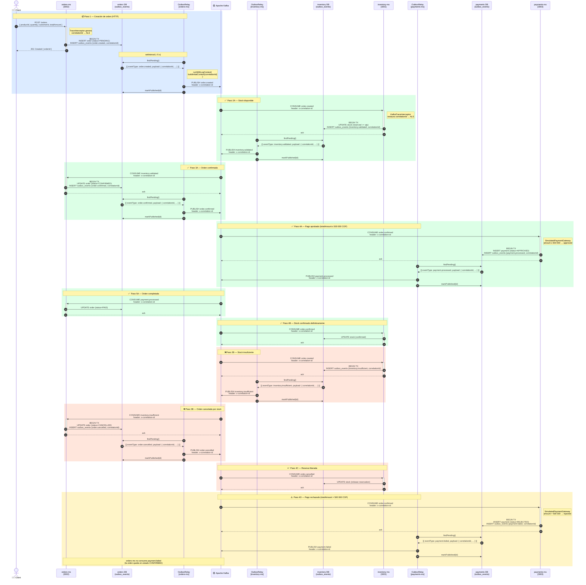

# Event-Driven Sequence Diagram

Comunicación entre microservicios mediante Apache Kafka.

---

## Flujo completo



---

## Tópicos Kafka

| Tópico                    | Publicado por    | Consumido por                   |
|---------------------------|------------------|---------------------------------|
| `order.created`           | orders-ms        | inventory-ms                    |
| `order.confirmed`         | orders-ms        | inventory-ms, payments-ms       |
| `order.cancelled`         | orders-ms        | inventory-ms                    |
| `inventory.validated`     | inventory-ms     | orders-ms                       |
| `inventory.insufficient`  | inventory-ms     | orders-ms                       |
| `payment.processed`       | payments-ms      | orders-ms                       |
| `payment.failed`          | payments-ms      | *(no consumer)*                 |

---

## Flujos resumidos

### ✅ Happy path (stock OK + pago aprobado)
```
POST /orders
  → order.created
    → inventory.validated
      → order.confirmed
        → payment.processed  →  order status: PAID
        → stock confirmed (inventory-ms)
```

### ❌ Stock insuficiente
```
POST /orders
  → order.created
    → inventory.insufficient
      → order.cancelled
        → stock released (inventory-ms)
```

### ⚠️ Pago rechazado (totalAmount > 500 000 COP)
```
POST /orders
  → order.created
    → inventory.validated
      → order.confirmed
        → payment.failed  (orders-ms no consume este evento)
        → stock confirmed (inventory-ms)
```
x